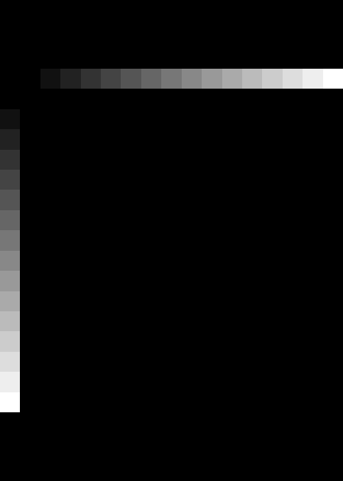
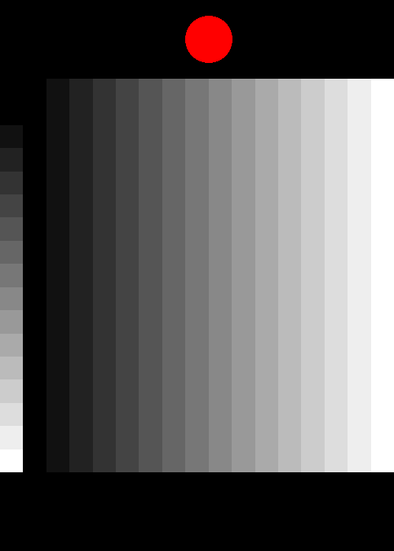
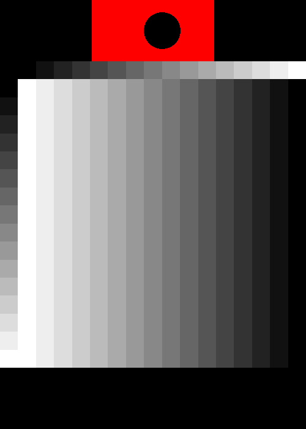
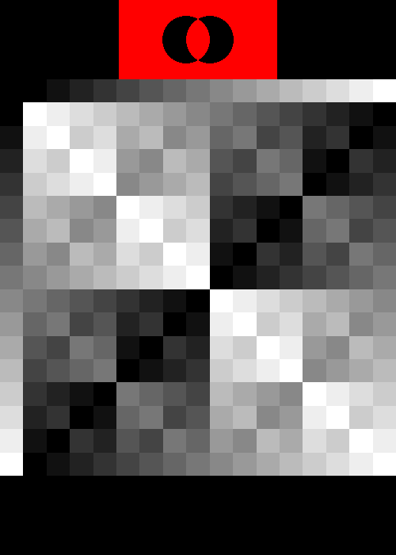
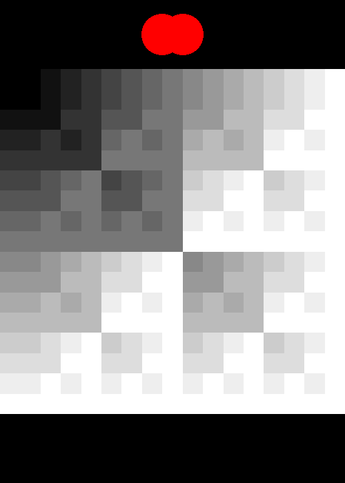
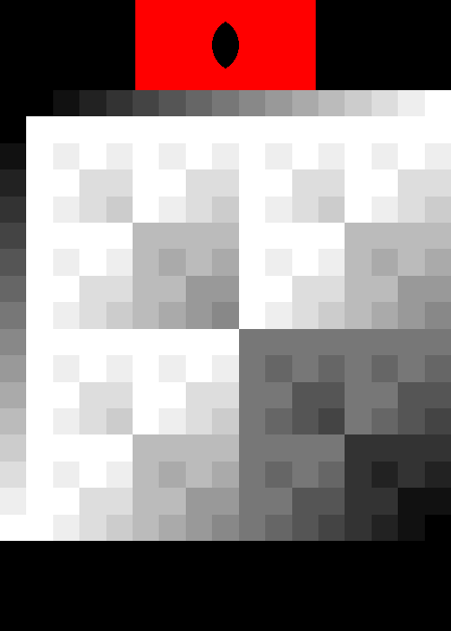
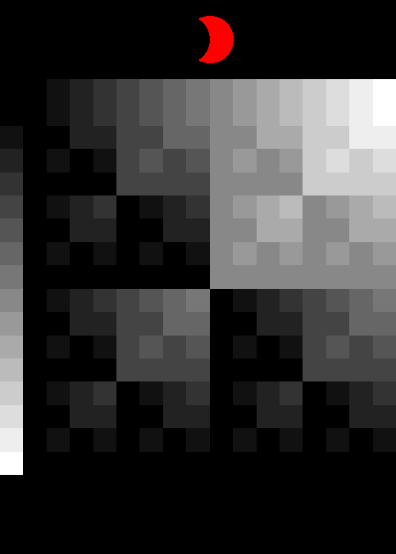
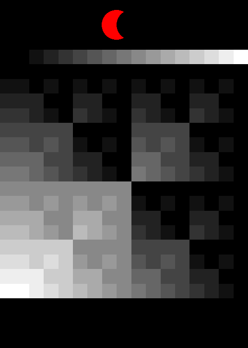
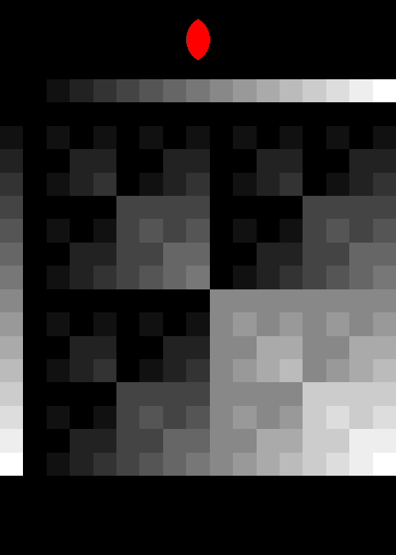

# Bitwise Boolean Operators

## True and False

| True | False |
|---|---|
| | 

## Single Input

| A | NOT A |
|---|---|
|  |

| B | NOT B |
|---|---|
|||

## XOR and XNOR

| A XOR B | B XOR B |
|---|---|
|  | 

## OR and Friends

|OR | B | NOT B |
|---|---|---|
|A | A OR B | B IMPLIES A|
|NOT A | A IMPLIES B | A NAND B |

| OR | B | NOT B |
|---|---|---|
|A |  |  |
|NOT A |  |  |

## NOR and Friends

If we take the four diagrams from the OR section above and
compute the NOT of the output, we get a new set of four tables:

|NOR | B | NOT B |
|---|---|---|
|A | A NOR B | B NOT IMPLIES A|
|NOT A | A NOT IMPLIES B | A AND B |

| | | |
|---|---|---|
||  |  |
||  |  |

## More notes

Some more observations about bitwise boolean operations:

- the fractal structure is always there
  - an (unsigned) integer under a bitwise op is just a direct product of individual booleans under the corresponding logic operator!
  - for 1 bit, you get a 2x2 table
  - for 2 bits, scale the 1-bit table by 2 and at each place, add the 1 bit table (giving a 4x4 matrix)
  - for 3 bits, scale the 1-bit table by 2^2 and at each place, add the 2-bit table (giving a 8x8 matrix)
  - for n bits, scale the 1-bit table by 2^(n-1) and at each place, add the (n-1)-bit table (giving a 2^nx2^n table)
  - nowhere did I reference specific operators, so this recursive structure exists regardless of the logic operator!
  - ❓ is this recursive pattern related to the Bayer matrix pattern for ordered dithering?
  - ❓ regardless, how would these bit patterns look if used as dither matrices?
  - conjecture: take any tuple of integers mod n (maybe even different n?), make a cayley table for some component-wise operation with the elements listed in lexicographical order. Then you'll see a generalization of this pattern
  - conjecture: the 16 boolean ops have generalizations in Z_n (...2^(n^2) of them?). Albeit the interpretation may be more about arithmetic than logic. 
- interpretations of bitwise operators on gray values:
  - T, F are constants (white, black)
  - A, B just select one of the two colors
  - NOT A, NOT B selects one of the two colors and inverts it
  - A XNOR B is some sort of weighted similarity between the two gray values. Similarity in the high bits gives a larger value than similarity in the low bits.
    - result will never be lighter than the inputs
  - A XOR B is some sort of weighted difference function. Again, high bits are weighted more.
    - this is also bitwise addition mod n!
  - A AND B is a component-wise minimum
    - tends to be dark unless both are bright
    - this is bitwise multiplication!
  - A OR B is a component-wise maximum
    - result is mostly bright except when both are dark.
  - NOT IMPLIES and NOR are rotations of the table for AND - so mostly dark except in one quadrant
  - IMPLIES and NAND are rotations of OR, so mostly light except in one color