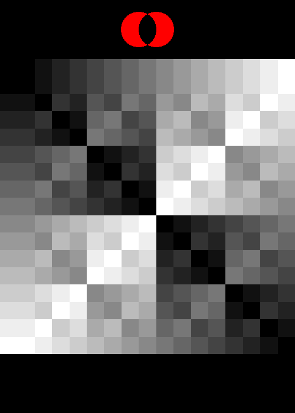

# Boolean Operations

Suppose you have two Boolean (true/false) values
and we want to combine them somehow to get a
third value. I.e. a function `OPERATOR(bool, bool): bool`.
What are the possible functions are there? How many are
there?

Each input can either be `true = 1` or `false = 0`. We
can arrange these into a table that covers all 4
combinations of A and B: 

| A | B | OPERATOR(A, B) |
|---|---|----------|
| 0 | 0 |  $x_0$   |
| 0 | 1 |  $x_1$   |
| 1 | 0 |  $x_2$   |
| 1 | 1 |  $x_3$   |

We have 4 places in the table where we can make a choice. I labeled these $x_0, x_1, x_2, x_3$.

Each one is a true/false value, so we have $2^4 = 16$ possible tables.

## The 16 possible Boolean operations

### Trivial Tables: TRUE and FALSE

The simplest thing we can do is ignore the input
and return a constant value (true or false).

| A | B | FALSE(A, B) |
|---|---|----------|
| 0 | 0 |  0   |
| 0 | 1 |  0   |
| 1 | 0 |  0   |
| 1 | 1 |  0   |

| A | B | TRUE(A, B) |
|---|---|----------|
| 0 | 0 |  1   |
| 0 | 1 |  1   |
| 1 | 0 |  1   |
| 1 | 1 |  1   |

## Single Input Tables

The next simplest thing we can do is select one of
the inputs and ignore the other one. Enter the operators
`A` and `B`:

| A | B | A(A, B) |
|---|---|----------|
| 0 | 0 |  0   |
| 0 | 1 |  0   |
| 1 | 0 |  1   |
| 1 | 1 |  1   |

| A | B | B(A, B) |
|---|---|----------|
| 0 | 0 |  0   |
| 0 | 1 |  1   |
| 1 | 0 |  0   |
| 1 | 1 |  1   |

## Maybe NOT

TODO: Description

| A | B | NOT_A(A, B) |
|---|---|----------|
| 0 | 0 |  1   |
| 0 | 1 |  1   |
| 1 | 0 |  0   |
| 1 | 1 |  0   |

| A | B | NOT_B(A, B) |
|---|---|----------|
| 0 | 0 |  1   |
| 0 | 1 |  0   |
| 1 | 0 |  1   |
| 1 | 1 |  0   |

### AND Then...

TODO: Description

| A | B | AND(A, B) |
|---|---|----------|
| 0 | 0 |  0   |
| 0 | 1 |  0   |
| 1 | 0 |  0   |
| 1 | 1 |  1   |

| A | B | NAND(A, B) |
|---|---|----------|
| 0 | 0 |  1   |
| 0 | 1 |  1   |
| 1 | 0 |  1   |
| 1 | 1 |  0   |

| A | B | OR(A, B) |
|---|---|----------|
| 0 | 0 |  0   |
| 0 | 1 |  1   |
| 1 | 0 |  1   |
| 1 | 1 |  1   |

| A | B | OR(A, B) |
|---|---|----------|
| 0 | 0 |  0   |
| 0 | 1 |  1   |
| 1 | 0 |  1   |
| 1 | 1 |  1   |

| A | B | NOR(A, B) |
|---|---|----------|
| 0 | 0 |  1   |
| 0 | 1 |  0   |
| 1 | 0 |  0   |
| 1 | 1 |  0   |

## If, Then (IMPLIES)

TODO: Description

| A | B | A_IMPLIES_B(A, B) |
|---|---|----------|
| 0 | 0 |  1   |
| 0 | 1 |  1   |
| 1 | 0 |  0   |
| 1 | 1 |  1   |

| A | B | B_IMPLIES_A(A, B) |
|---|---|----------|
| 0 | 0 |  1   |
| 0 | 1 |  0   |
| 1 | 0 |  1   |
| 1 | 1 |  1   |

## A AND NOT B, that is the question (NOT IMPLIES)

TODO: Description

| A | B | A_NOT_IMPLIES_B(A, B) |
|---|---|----------|
| 0 | 0 |  0   |
| 0 | 1 |  0   |
| 1 | 0 |  1   |
| 1 | 1 |  0   |

| A | B | B_NOT_IMPLIES_A(A, B) |
|---|---|----------|
| 0 | 0 |  0   |
| 0 | 1 |  1   |
| 1 | 0 |  0   |
| 1 | 1 |  0   |


## Different and Same: XOR and XNOR

Exclusive OR (XOR) is an operator that is true
when one or the other input is true, but not both.
Another way to express this is "the value and A and B
are different"

| A | B | XOR(A, B) |
|---|---|----------|
| 0 | 0 |  0   |
| 0 | 1 |  1   |
| 1 | 0 |  1   |
| 1 | 1 |  0   |

Equivalent Expressions:

- `(A AND (NOT B)) OR ((NOT A) AND B))`

If we negate this, we now see cases where A and B
are both false or both true. Or in other words,
A and B are equal.

| A | B | XNOR(A, B) |
|---|---|----------|
| 0 | 0 |  1   |
| 0 | 1 |  0   |
| 1 | 0 |  0   |
| 1 | 1 |  1   |

Equivalent expressions:

- `NOT (A XOR B)`
- `(A AND B) OR ((NOT A) AND (NOT B))`

## As Set Operations


| Operator | Set Operation | Description |
| --- | --- | --- |
| FALSE | $\emptyset$ | Empty set (set with no elements) |
| TRUE | $U$ | Set of all elements (U for Universe) |
| A | $A$ | Elements in A |
| B | $B$ | Elements in B |
| NOT A | $A^C = U - A$ | Elements not in A |
| NOT B | $B^C$ | Elements not in B |
| A OR B | $A \cup B$ | Union. Elements in A, B, or both |
| A NOR B | $(A \cup B)^C$ | Elements in neither A nor B |
| A AND B | $A \cap B$ | Intersection. Elements in both A and B |
| A NAND B | $(A \cap B)^C$ | Elements not in both A and B |
| A NOT IMPLIES B | $A - B$ | Set difference - elements in A but not B|
| B NOT IMPLIES A | $B - A$ | Elements in B but not A |
| A IMPLIES B | $(A - B)^C$ | All elements except the ones in just A |
| B IMPLIES A | $(B - A)^C$ | All elements except the ones in just B |
| A XOR B | $(A - B) \cup (B - A)$ | Symmetric Difference |
| A XNOR B | $(A \cap B) \cup (A \cup B)^C$ |Set of elements in both A and B or in neither of them| 

## Signed Distance Fields

| Boolean Operator | SDF Operation | Description |
| --- | --- | --- |
| FALSE | $+\infty$ | Every point is outside the surface |
| TRUE | $-\infty$ | Every point is inside the surface |
| A | $A$ | Select A |
| B | $B$ | Select B |
| NOT A | $-A$ | Flip the inside/outside of the surface |
| NOT B | $-B$ | Flip the inside/outside of the surface |
| A OR B | $\min(A, B)$ | For points outside the surface, this acts as UNION. [with caveats...](https://iquilezles.org/articles/interiordistance/) |
| A NOR B | $-\min(A, B)$ | Using the equivalent formula NOT (A OR B)|
| A AND B | $\max(A, B)$ | For points outside the surface, this acts as INTERSECTION |
| A NAND B | $-\max(A, B)$ | Using the equivalent formula NOT (A AND B) |
| A NOT IMPLIES B | $\max(A, -B)$ | Set difference using the equivalent formula A AND NOT B|
| B NOT IMPLIES A | $\max(-A, B)$ | Set difference using the equivalent formula B AND NOT A |
| A IMPLIES B | $-\max(A, -B)$ | Negation of set difference |
| B IMPLIES A | $-\max(-A, B)$ | Negation of set difference |
| A XOR B | $\min(\max(A, -B), \max(-A, B))$ | Symmetric Difference |
| A XNOR B | $\min(\max(A, B), -\min(A, B))$ |Set of elements in both A and B or in neither of them |

## Programming: Logic Operators

| Boolean Operator | Bitwise Operator | Description |
| --- | --- | --- |
| FALSE | `false` |  |
| TRUE | `true` | |
| A | `A` | Select A |
| B | `B` | Select B |
| NOT A | `!A` | Logical NOT |
| NOT B | `!B` | Logical NOT |
| A OR B | `A \|\| B` | Logical OR |
| A NOR B | `!(A \|\| B)` | Negation of OR|
| A AND B | `A && B` | Logical AND |
| A NAND B | `!(A && B)` | Negation of AND |
| A NOT IMPLIES B | `A && (!B)` | A AND (NOT B) |
| B NOT IMPLIES A | `(!A) && B` | (NOT A) AND B |
| A IMPLIES B | `(!A) \|\| B` | (NOT A) OR B |
| B IMPLIES A | `A \|\| (!B)` | A OR (NOT B) |
| A XOR B | `A != B` | Not equals. On a boolean, this is the same as XOR |
| A XNOR B | `A == B` | Equality testing. On a boolean, this is the same as XOR|

## Programming: Bitwise Operations

>[!INFO]
>See also [Patterns in Bitwise Boolean Operators](./bitwise-boolean.md) for further explorations. There are
> some pretty patterns when interpreted as colors!
>
> 

In programming, sometimes we want to apply these
logic functions to the bits of a (often unsigned) integer.

For example, bitwise AND:

```
(comparing column by column)
A = 0b1001
   BITWISE AND
B = 0b1010
    ------
    0b1000
```

For the table below, I'm using 8-bit unsigned integers
(i.e. numbers from 0 to 255) to keep this simple.

| Boolean Operator | Bitwise Operator | Description |
| --- | --- | --- |
| FALSE | `0 = 0x00 = 0b00000000` | no bits set |
| TRUE | `255 = 0xFF = 0b11111111` | all bits set |
| A | `A` | Select A |
| B | `B` | Select B |
| NOT A | `~A` | Bitwise NOT, flips all the bits |
| NOT B | `~B` | Bitwise NOT |
| A OR B | `A \| B` | Bitwise OR |
| A NOR B | `~(A \| B)` | Using the equivalent formula NOT (A OR B)|
| A AND B | `A & B` | Bitwise AND |
| A NAND B | `~(A & B)` | Using the equivalent formula NOT (A AND B) |
| A NOT IMPLIES B | `A & (~B)` | Set difference using the equivalent formula A AND NOT B|
| B NOT IMPLIES A | `(~A) & B` | Set difference using the equivalent formula B AND NOT A |
| A IMPLIES B | `(~A) \| B` | Using the equivalent formula (NOT A) OR B |
| B IMPLIES A | `A \| (~B)` | Negation of set difference |
| A XOR B | `(A & (~B)) \| ((~A) & B)` | (A AND NOT B) OR (NOT A AND B) |
| A XNOR B | `(A & B) \| ~(A \| B)` | (A AND B) OR (A NOR B) |

## More notes

- for bitwise boolean operators, if you plot this as a 2D table, there are only a handful of table shapes, up to reflection/rotation (see notebook)
    - have bitwise AND (&), OR (|), NOT (~), and sometimes XOR (^). Focus on u8 types to avoid having to worry about managing the upper bits with NOT
- SDF operations use min, max and negative for union, intersection and complement. Though this is only correct for the outside of the shape (see iq article).
  - I think I once explored how a true union/intersection function must look. It's kinda like min but one quadrant had curved lines... i forget the details.
- clipping masks
  - adding more shapes to a clip path is a union
  - adding a new clip path is implicitly an intersection
  - clip paths can be inverted, this is like complement
  - rendering twice with save and restore is also like a union
  - since the operations are applied in place to the graphics state, some booleans are tricky to express. Exercise: can I derive all 16 booleans?
- alpha compositing - it's a little more nuanced because you can blend between values
- CSG in 3D modeling - I'm not familiar with the details but this exists.
- functional completeness
  - smaller set of operators that can be used to create the others (albeit somewhat inefficiently)
  - and, or and not
  - nand
  - there's a few more sets
  - exercise: derive the 16 operators with each set. And/or/not is straightforward, but I haven't done so for NAND before