# Case Study: Bass Fretboard

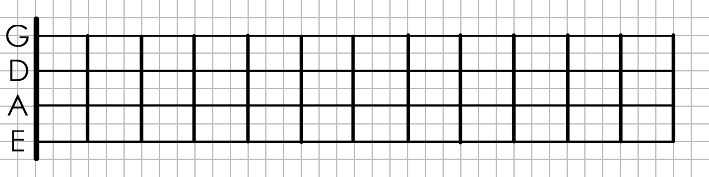

## Fretboard Structure

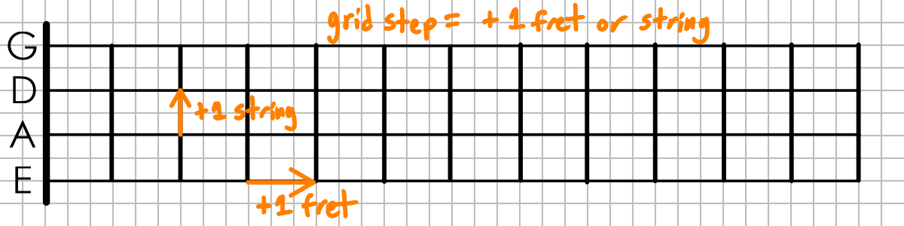

- A bass guitar typically has 4 strings that stretch down the length of the fretboard.
- There are roughly 20 frets (metal bars across the neck of the guitar) used to locate notes along the string.
    - Note: This diagram is not to scale. The frets are [spaced _logarithmically_](../patterns/log-fret-spacing.md) to produce the correct pitches.
    - The number of frets varies from bass to bass.
- Taken together, the frets and strings form a grid. Let's define a **grid step** as moving to the next fret or string, as pictured in the diagram above.
    - This is analagous to [City Blocks](./city-blocks.md) in that we treat the two directions on equal footing, even though physically these steps are not the same size.

## Pitches On The Fretboard

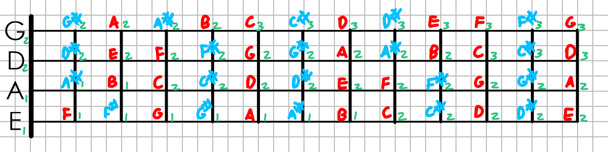

In standard tuning, a bass guitar's strings are tuned to `E1, A1, D2, G2`, each 5 semitones (a perfect fourth) higher than the previous one. As you move down one of the strings, each fret increases the pitch by one semitone (minor second). Together this makes a partial `(m2, P4)` [isomorphic keyboard](../patterns/rect-iso-piano.md).

Listing the pitches is a lot to absorb at once, so it's helpful to break down the pitches into pitch classes and octave numbers.

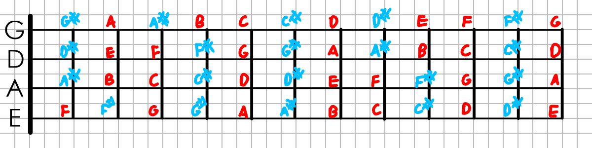

If we erase the octave numbers, we get the pitch classes. Notice that the same letter appears in several spots on the fretboard.

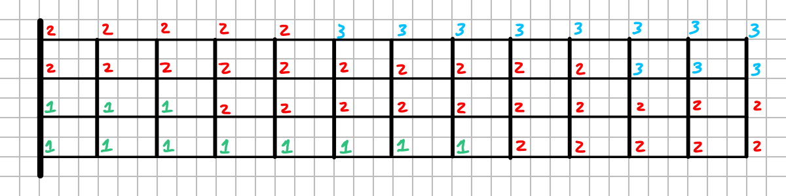

If instead we erase the letters, we get the octave numbers.
Here, we get a diagonal [gradient](../patterns/gradient.md) from the low E string, increasing slowly both down the string and across the strings.


## Pitch Symmetries

Studying the diagrams from the previous diagram,
we can identify some [symmetries](../patterns/symmetry.md). First, let's look at the absolute pitches again:

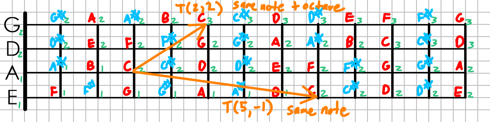

- When we move 5 frets down the string, then over to the next lowest string, the pitch is exactly the same.
- When we move 2 frets down the string, and 2 strings up, we get a pitch exactly one octave (a perfect eighth) higher.

If we define the functions:
- `pitch(fret, string)` - get the absolute pitch of a particular fret and string (as in the diagram)
- `translate(frets, strings)` - Move across the fretboard by the number of frets and strings specified
- `transpose(interval)` - Increase a pitch by a musical interval

Then `pitch()` has:

- `translate(5, -1)`-symmetry
- `(translate(2, 2), transpose(P8))`-symmetry

Next, let's do the same thing for the pitch class diagram:

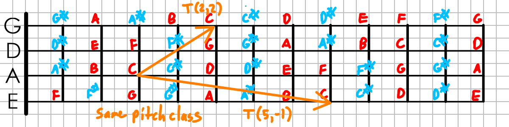

- Again, moving 5 frets down the string and 1 string down produces an identical pitch class
- This time, moving 2 frets over and 2 strings up produces the _same_ value, as we are ignoring octaves.

So if `pitch_class(frets, strings)` is a function that returns the pitch class, then this function has the following symmetries:

- `translate(-5, 1)`-symmetry
- `translate(2, 2)`-symmetry

## Semtione Distance Function

IMG: Fretboard labeled with semitones above E1

A different way of thinking about the fretboard is as a [distance function](../patterns/distance-function.md) that measures semitones
as measured from the lowest note (E0).

Observing that,

- Moving down the string by +1 fret increases the pitch by 1 semitone 
- The tuning `E1 A1 D2 G2` means the strings are tuned a perfect fourth apart. In other words, as we move up +1 string, we increase the pitch by 5 semitones.

we can define the distance function directly as:

```
semi(fret, string) = fret + 5 * string
```

If we plot this function over a fretboard, we
get a [gradient](../patterns/gradient.md) stretching diagonally across the fretboard.

IMG: Diagram of fretboard with diagonal lines acting as a semitone ruler, with octaves drawn in a thicker line.

## Pitch Class Plane Waves

What about pitch classes? Since they repeat across the fretboard, it won't be a distance function. However, there are still patterns to be found.

Each pitch class corresponds to a number of semitones in `[0, 11]`. Usually they're numbered from C, but since the lowest note is an E, we'll measure it from E.

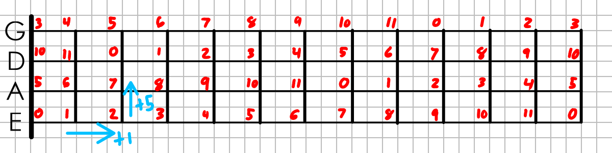

Given the semitone distance function `semi()` from the previous section, it's easy to 

```
pc(fret, string) = mod(semi(fret, string), 12)
```

Plotting this on the fretboard, we get a set of parallel lines:

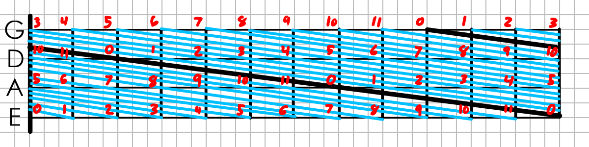

A couple possible interpretations of this pattern:

- A repeating pattern of [stripes](../patterns/stripes.md)
- A [plane wave](../patterns/plane-wave.md) with (linear) wavevector of `(1, 5)` semitones/step
- A [wallpaper pattern](../patterns/wallpaper-pattern.md) with `o` symmetry (orbifold notation) generated by translations (5, -1) and (2, 2).

## Scales on a Fretboard

To make a scale on a fretboard, we can draw a contiguous box around 12 distinct pitches to form a [chromatic scale](../patterns/uniform-scale.md) Given that there are many copies of each note available, there are several ways to do this. Let's define some constraints to narrow our search:

- For playability, the box shouldn't be too wide to avoid large jumps up/down the string.
- Let's focus on pitches within a single octave for simplicity.

With these constraints, we get 5 possible scale box shapes, each one shifting one fret down the string from the previous one. Since semitones are arranged in diagonal fashion, the box changes shape slightly.

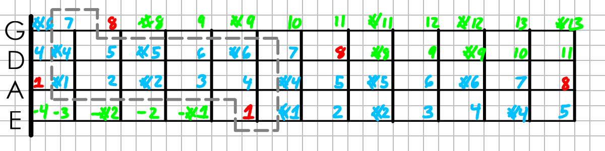
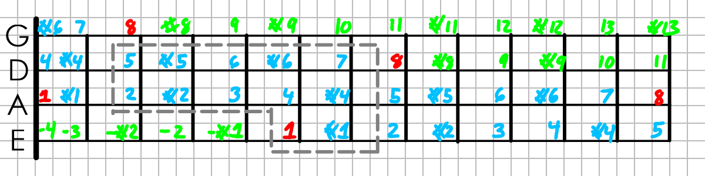
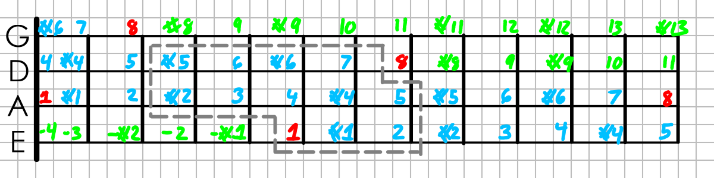
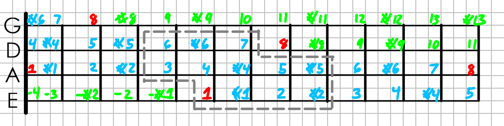
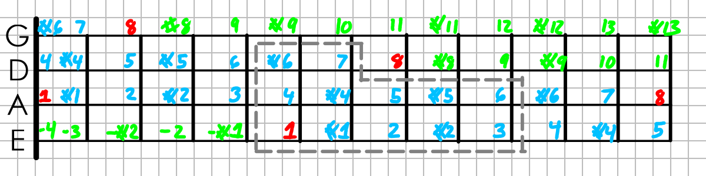

🚧 TODO: related concepts and patterns. Quick outline for now:

- A scale box is an example of a fundamental domain
    - Need to clarify what this means for gradients, as we have `(translate, transpose)` symmetry, not the usual `translate` symmetry
    - Fundamental domains are related to quotient spaces
    - also sections/retractions in category theory
- You can fit many copies of the scale box to make a tiling, the symmetries match the symmetries of the underlying pitches
- Translating the scale box by some other translation amount results in a _transposed_ scale.

