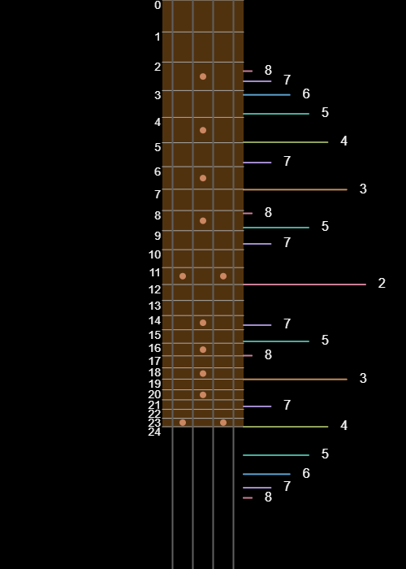
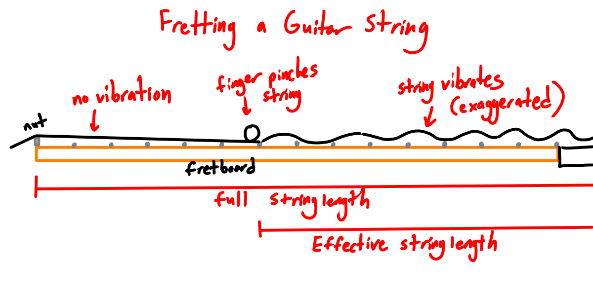
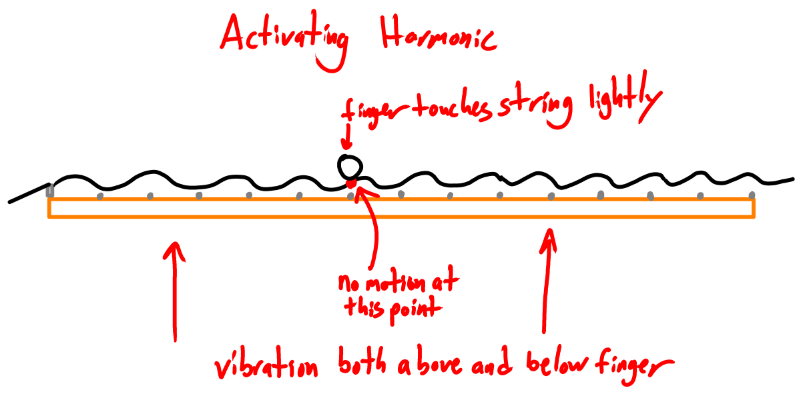
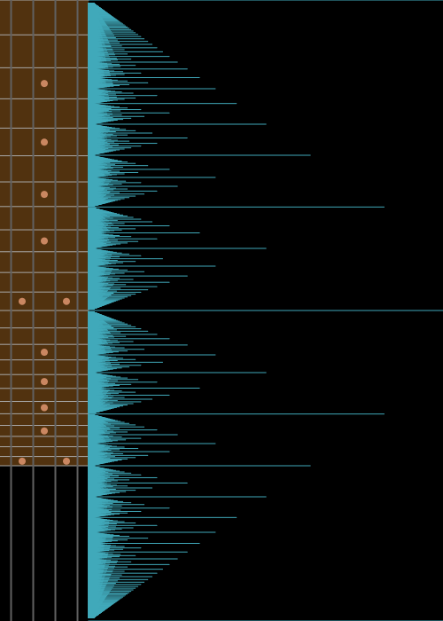

# Guitar Harmonics



## Fretting a Note vs. Harmonics

> Pressing the string against a fret shortens the length and therefore increases the pitch.
>
> Lightly touching a point on the string will filter for a specific harmonic of the string's vibration.

### Fretting a Note



SOUND: Add a sound clip of playing the first several notes along a single string

When you fret a note, you pinch the string against one of the frets. This means the part above the fret will not vibrate. The part below the fret vibrates. This is equivalent to playing an open string with a _shorter length_.

This is the same as solving the [wave equation on a string](../patterns/wave-equation.html) with the following constraints:

  - $f(x) = 0, x \le X$ (where $F$ is the position of the fret measured from the nut)
  - $f(F) = 0$
  - $f(L) = 0$

These constraints are equivalent to $f(0) = 0, f(L - F) = 0$, i.e. wave equation on a _shorter string_ fixed at both ends.

### Activating a Harmonic



SOUND: Add a sound clip of playing the first 8 harmonics down a single string

When you play a harmonic of the string, you lightly touch the string without making contact with the fretboard. This means the point where you touch the string is fixed, but the string may vibrate both above and below. 

This setup creates a different set of constraints on the wave equation:

- $f(0) = 0$
- $f(x) = 0$, where $x$ is the position of the finger, measured from the nut.
- $f(L) = 0$

The solutions will be explored below. In short, the set of harmonics is restricted, but it depends on the choice of $x$ as a fraction of the string's length.

## Nodes of Each Harmonic

> Touching a point on the string a fraction of the way down its length will produce the harmonic of its denominator in lowest terms.

Let's look at the different harmonics of the full string and see where they have a node, i.e. values of $x$ where $f(x) = 0$.

| Harmonic number | Nodes at |
|-----|---|
| 1   | $0, L$ |
| 2   | $0, (1/2)L, L$ |
| 3   | $0, (1/3)L, (2/3)L, L$ |
| 4   | $0, (1/4)L, \cancel{(2/4)L}, (3/4)L, L$
| ... | ...|
| n   | $(0/n)L=0, (1/n)L, (2/n)L, ..., (n/n)L=L$ |

So each harmonic $n$ has nodes at multiples of $L/n$ along the string. These are the key points for activating the harmonic.

However, not every fraction produces a new harmonic. For example, $(3/6)L = (2/4)L = (1/2)L$, and only the second harmonic is heard.

We can summarize this as follows:
- Harmonics will be heard at points $x = (m/n)L$ where $m/n$ is a rational number in _lowest terms_
- The $n$-th harmonic may be heard at multiple points on the string, for any $m$ such that $m/n$ is an irreducible fraction.

## Locating Harmonics on a Guitar String

Where do these fractions of the string show up on a guitar fretboard?

I made a diagram of the locations for the first 8 harmonics in my other project, [`p5-sketchbook`](https://ptrgags.dev/p5-sketchbook/GuitarHarmonics/):


The following subsections detail the calculations
used to make that diagram.

### Fret Positions

First, we need to know where exactly each
fret is along the neck as a percentage of the
length. This way we can compare with the
harmonics.

- An open string has length $L_0$ and sounds at frequency $f_0$ which depends on its tuning.
- The nth fret increases the pitch by $n$ semitones, i.e. $f_n = 2^{n/12}f_0$
- $f \propto 1/L$ where $L$ is the length of the vibrating portion of the string (i.e. the portion between the fret and the bridge)
- This means $L \propto 1/f$
- Since we scaled $f$ by $2^{n/12}$, $L$ is _divided_ by $2^{n/12}$, i.e. $L_n = 2^{-n/12}L_0$, measured from the bridge.
- Measuring from the nut, we have $L_0 - L_n = (1 - 2^{-n/12})L_0$

Let's make a table of the fret positions measured from the nut.

| Fret number | $x = (1 - 2^{-n/12})L$ |
|---|---|
|0  | $0$ (exact) |
|1  | $0.056L$|
|2  | $0.109L$
|3  | $0.159L$
|4  | $0.206L$
|5  | $0.251L$
|6  | $0.293L$
|7  | $0.333L$
|8  | $0.370L$
|9  | $0.405L$
|10 | $0.439L$
|11 | $0.470L$
|12 | $0.5L$ (exact)
|13 | $0.528L$
|14 | $0.555L$
|15 | $0.580L$
|16 | $0.604L$
|17 | $0.625L$
|18 | $0.646L$
|19 | $0.666L$
|20 | $0.685L$
|21 | $0.702L$
|22 | $0.719L$
|23 | $0.735L$
|24 | $0.75L$ (exact)

### Harmonic Positions

Now, let's list the positions where each harmonic can be heard for the first 8 harmonics.
See [§ Nodes of Each Harmonic](#nodes-of-each-harmonic) above.

| Harmonic $n$ | $m/n$ (fraction of length) |
| -------- | ---------- |
|   1      | $0, 1$ |
|   2      | $0.5$ |
|   3      | $0.333, 0.667$ |
|   4      | $0.25, \cancel{0.5}, 0.75$ |
|   5      | $0.2, 0.4, 0.6, 0.8$ |
|   6      | $0.167, \cancel{0.333}, \cancel{0.5}, \cancel{0.667}, 0.833$ |
|   7      | $0.143, 0.286, 0.429, 0.571, 0.714, 0.857$
|   8      | $0.125, \cancel{0.25}, 0.375, \cancel{0.5}, 0.625, \cancel{0.75}, 0.875$|

### Pattern Along Fretboard

Let's interleave these values to see where they show up on
the fretboard. The dashed lines indicate frets. Indented
lines indicate harmonics that show up between frets.

```
0----------0      n=1 (open string)
1----------0.056
2----------0.109
  0.125           n=8
  0.143           n=7
3----------0.159
  0.167           n=6
  0.2             n=5 (~4th fret)
4----------0.206
  0.25            n=4 (~5th fret)
5----------0.251
  0.286           n=7
6----------0.293
7----------0.333  n=3 (rounded)
8----------0.370
  0.375           n=8
  0.4             n=5
9----------0.405
  0.429           n=7
10---------0.439
11---------0.470
12---------0.5    n=2 (exact)
13---------0.528
14---------0.555
  0.571           n=7
15---------0.580
  0.6             n=5
16---------0.604
17---------0.625  n=8 (rounded)
18---------0.646
19---------0.666
  0.667           n=3
20---------0.685
21---------0.702
  0.714           n=7
22---------0.719
23---------0.735
24---------0.75   n=4 (exact)
  0.8             n=5  ---|
  0.833           n=6     |--- around electric
  0.857           n=7     |    guitar pickups
  0.875           n=8  ---|
```

## Extended Pattern

What happens if you extend the pattern to infinity? You fill in the length of the string
with harmonics. When visualized like the diagram below, this makes a fractal pattern of lines.



I like to think of this like a [ruler](../case-studies/ruler.html) for the
rational numbers between 0 and 1. As the
fractions use smaller denominators, the lines
get increasingly shorter.