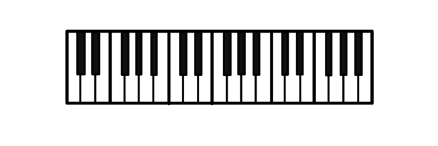
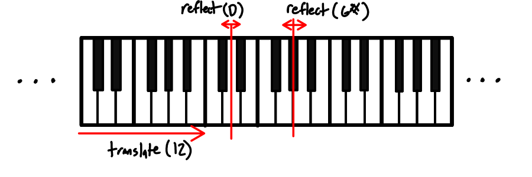
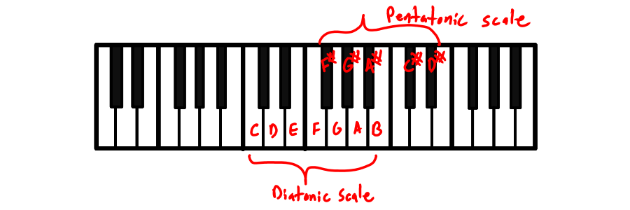

# Case Study: Piano Keyboard

## Patterns

- visual [symmetries](../patterns/symmetry.md) of the keyboard layout[^1]
    - `translate(12)` - Every time you move up the keyboard by 12 keys, the pattern of black and white keys looks the same.
    - `reflect(D)` - if you were to flip the keyboard backwards using a mirror placed on one of the D keys, you end up with the same pattern of black and white keys. 
    - `reflect(G#)` - The same thing happens if you place the mirror at a G# on the keyboard.

[^1]: Here, I'm imagining the keyboard to be [infinitely long](../patterns/infinite-piano.md) for symmetry in the strict sense. Another possible view is that the keyboard finite, and the symmetry relationships hold everywhere on the keyboard _except at the ends_.

IMG: Diagram of `E(12, 5) and E(12, 7)` compared with the piano keyboard

- [Euclidean Rhythms](../patterns/euclidean-rhythms.md)
    - Euclidean rhythm `E(n, k)` puts $k$ objects into $n$ slots as evenly as possible.
    - Up to cyclic shift, the black keys within an octave match the pattern of `E(12, 5)`
    - The white keys then are the complimentary pattern `E(12, 7)`

- Musical Scales
    - If you play across the white keys, you get a [diatonic scale](../patterns/diatonic-scale.md).
    - If you play across the black keys, you get a [pentatonic scale](../patterns/pentatonic-scale.md)
    - If you move across the keyboard in fix-sized steps you get what I'll call [uniform scale](../patterns/uniform-scale.md) for lack of a better term
- Semitones and Frequency
    - The keys of a piano keyboard are one semitone (half-step) apart
    - Octaves, semitones and cents form a [logarithmic scale for frequency](../patterns/frequency-log-scale.md).
    - You could theoretically [extend the keyboard forever](../patterns/infinite-piano.md) in both directions.
    - However, there's a practical limitation: Humans can only hear between 20 Hz and 20 kHz, a range of about 10 octaves

"a range about 10 octaves"

Since an octave is a ratio of 2:1, we can compute the octave range for human hearing using the formula:

$O = \log_2(f_{max}/f_{min}) = \log_2(20,000/20) = \log_2(1000) \approx 9.97$

So a little shy of 10 octaves for an ideal human listener. In practice, not everyone can hear the full range (especially in the high end).

## Variations

- Isomorphic Keyboards
    - The piano keyboard layout is due to hundreds of years of history. Yet it's not the only way to arrange the 12 notes of the chromatic scale. [Isomorphic keyboards (wiki)](https://en.wikipedia.org/wiki/Isomorphic_keyboard) are layouts where musical intervals have the same shape anywhere on the keyboard.
    - [Linear Iso Keyboard](../patterns/linear-iso-keyboard.md)
        - The piano roll in a DAW uses this format
        - The [Dodeka keyboard (wiki)](https://en.wikipedia.org/wiki/Dodeka_keyboard) is another example
    - [Rectangular Iso Keyboard](../patterns/rect-iso-piano.md) - A 2D grid of pitches with a fixed step size in each direction 
        - [Bass Fretboards](./bass-fretboard.md) are one such example.
        - [Guitar Fretboards](./guitar-fretboard.md) _almost_ match this pattern.
    - [Hexagaonal Iso Keyboard](../patterns/hex-iso-piano.md) - If you put the notes on a hex grid with some slight modifications, you get an even
- [Ring Keyboard](../patterns/ring-keyboard.md) - If you ignore the octave of notes, they keyboard loops around. You could draw this as a circular ring.