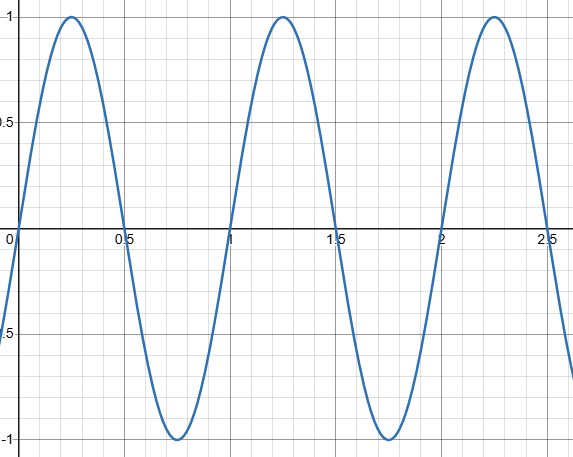
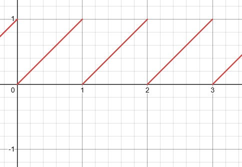
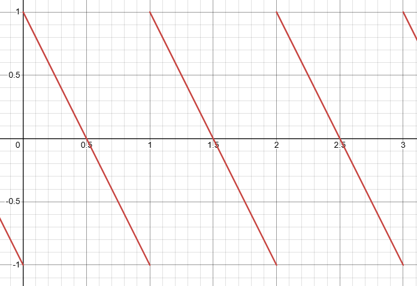
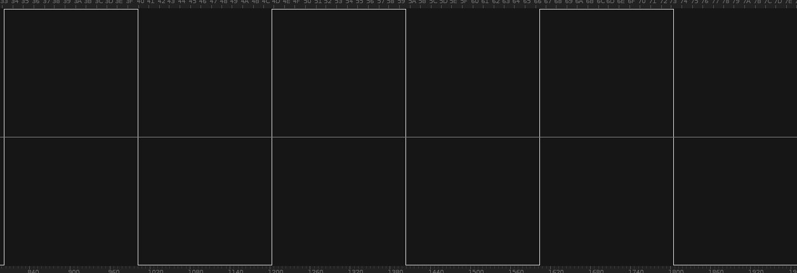

# Basic Waves

🚧 Outline for now

## Sine Wave

- $\operatorname{sine}(t) = \sin(2\pi t)$

## Ramp Wave

- $\operatorname{ramp}(t) = \operatorname{fract}(t) = \operatorname{mod}(t, 1) $
- This is an [unsigned signal](./normalized-value.md), i.e. the range of values is $[0, 1]$
- This serves as a building block for some of the waves below

## Sawtooth Wave

- `sawtooth = invert * to_unsigned * ramp`
- $\operatorname{sawtooth}(t) = 1 - 2\operatorname{mod}(t, 1)$
- TODO: This one needs more explanation.

## Square Wave

- $\operatorname{square}(t) = \operatorname{sgn}(\sin(2 \pi t))$
- `square = sgn * sine`
- TODO: Alternate recipes. E.g. a digital square wave from $[0, 1]$ is just $\operatorname{mod}(n, 2)$ for an integer $n$

## Triangle Wave

- $\operatorname{triangle}(t)= 2\left|2\operatorname{mod}\left(x-\frac{1}{4},\ 1\right)-1\right|\ -\ 1$
- TODO: This one needs more explanation. You're scaling and shifting a sawtooth wave, using absolute value to fold the saw shape into triangles, and shifting again
- `triangle = to_signed * abs * to_signed * ramp * translate(1/4)`
- TODO: Alternate recipes e.g. as a piecewise linear curve that interpolates $0 \to 1 \to 0 \to -1 \to 0$ is easier to understand

## Other Notes

- Derive the Fourier series for each and add them to the recipes
- SOUND: Make sound clips for each wave type. Maybe a short melody
- Show what these patterns look like as visual gradients (when remapped to be unipolar)
- Make a page about normalized ranges $[0, 1]$ = unipolar = unsigned (float) and $[-1, 1]$ = bipolar = signed (float) since these come up a lot when working with waves! even some of the formulas above make use of this
- Maybe add unsigned ramp wave (modulo) to the list, as it's a building block used to make sawtooth and 
- Describe the waves in terms of transforming a sine wave

## Test of embedding audio clip

<audio src="https://assets.ptrgags.dev/file/ptrgags-website-assets/music-albums/loops/02_2024-04-14_Bouncy.flac"></audio>
