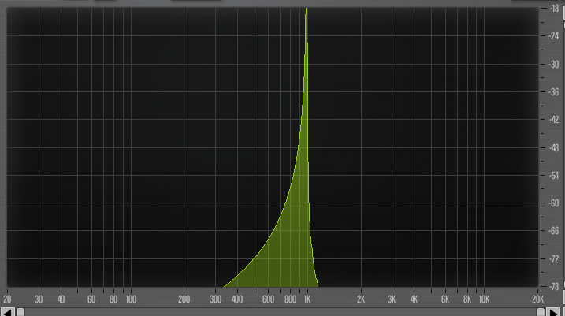

# Fourier Series for Basic Waves

🚧 Outline for now

## Sine and Cosine

$$
\begin{align*}
\mathscr{F}\sin_n &= \frac{1}{2i}(\delta_n - \delta_{-n}) \\
\mathscr{F}\cos_n &= \frac{1}{2}(\delta_n + \delta_{-n}) \\
\end{align*}
$$

Proof

From the [circular motion definitions for sin/cos](./sin-cos-circle.html), we
see that they're each a sum of two circular motions.

$$
\begin{align*}
 \cos_n &= \frac{1}{2}(C_n + C_{-n})\\
 \sin_n &= \frac{1}{2i}(C_n - C_{-n})\\
\end{align*}
$$

Since $\mathscr{F}C_n = \delta_n$ (see [Fourier Transform Pairs](./fourier-transform-pairs.html) and $\mathscr{F}$ is [linear](./fourier-symmetries.html#linearity), the only thing that changes is the circular motions become
peaks

$$
\begin{align*}
\mathscr{F}\sin_n &= \frac{1}{2i}(\delta_n - \delta_{-n}) \\
\mathscr{F}\cos_n &= \frac{1}{2}(\delta_n + \delta_{-n}) \\
\end{align*}
$$

So both waveforms are a pair of peaks at opposite frequencies. The only
difference is the 

### One Peak vs Two Peaks

If you've ever looked at a sine wave through a spectrum analyzer, you will
have seen a single peak, not two peaks. Why is this?

A spectrum analyzer simplifies the view of the frequency spectrum in two
ways:

- It plots the _magnitude_ of the Fourier series, $|\hat{f}|$ rather than the full complex-valued series. This gives you the amplitude, ignoring phase.
- It combines each positive frequency $n$ with its negative version $-n$

So for example, a cosine wave combines $(1/2)\delta_n$ and $(1/2)\delta_{-n}$ into
a single peak $1\delta_n$

🚧TODO: 
- Both of these have to do with symmetry of real-valued functions, I haven't yet looked into how exactly that works

## Square

🚧 Under Construction, this section is a bit of a mess right now...

Let's look at a square wave with period 1 unit.

- It's +1 for the first half of each cycle
- It's -1 for the second half of each cycle

So A single cycle could be described by combining two [boxcar functions](./fourier-transform-pairs.html#boxcar-and-transformed-sinc):

$$
\text{square}(t) = \text{box}(t; 0, 1/2) - \text{box}(t; 1/2, 1)
$$

Since the period is 1, the Fourier Series coefficients are exactly the Fourier Transform of the boxcars sampled at integer frequencies:

$$
\begin{align*}
 a_n &= \mathscr{F}\text{square} \\
     &= \mathscr{F}(\text{box}(t; 0, 1/2) - \text{box}(t; 1/2, 1))\\
     &= \mathscr{F}\text{box}(t; 0, 1/2) - \mathscr{F}\text{box}(t; 1/2, 1) \\
     &= (1/2)C_{-n/4}\text{sinc}(n/2) - (1/2)C_{-3n/4}\text{sinc}(n/2) \\
     &= (1/2)\text{sinc}(n/2)(C_{-n}(1/4)-C_{-n}(3/4)) \\
\end{align*}
$$

Alternatively

⚠️ I made a mistake somewhere below, I'm off by a factor of 2...

$$
\begin{align*}
  a_n &= \mathscr{F}\text{square} \\
  &= \mathscr{F}(\text{box}(t; 0, 1/2) - \text{box}(t; 1/2, 1))\\
  &= \mathscr{F}\text{box}(t; 0, 1/2) - \mathscr{F}\text{box}(t; 1/2, 1) \\
  &= \frac{1}{-2\pi n i}(C_{-n}(1/2) - C_{-n}(0))- \frac{1}{-2\pi n i}(C_{-n}(1) - C_{-n}(1/2)) \\
  &= \frac{1}{-2 \pi n i}(2 C_{-n}(1/2) - 1 - 1) \\
  &= \frac{1}{\pi n i}(C_{-n}(1/2) - 1) \\
  &= \frac{1}{\pi n i}((-1)^n - 1)
\end{align*}
$$

When $n$ is even, the part in parentheses is $(1 - 1) = 0$, so _all the even terms vanish!_

Meanwhile, for odd $n$, we have $(-1 - 1) = -2$, so the result is:

$$
c_n =
\frac{-2}{\pi n i} = \frac{2i}{\pi n}, n \; \text{odd}

$$

A square wave is +1 for the first half-cycle, and -1 for the second half-cycle.
So we can split the Fourier Series 

$$
\begin{align*}
 \mathscr{F} \text{square} &= \int_{-\infty}^\infty \text{square}\; C_{-k} dt\\
 &= \sum_{l=-\infty}^\infty\left(\int_0^{1/2}C_{-k}dt - \int_{1/2}^1C_{-k}dt\right)\\
\end{align*}
$$

We can simplify this a bit, using the symmetry $C_n(t + 1/2) = -C_n(t)$.

IMG: Diagram that shows how this symmetry works visualy

$$
\begin{align*}
 &= \sum_{l=-\infty}^\infty\left(\int_0^{1/2}C_{-k}dt - \int_0^{1/2} -C_{-k}dt\right) \\
 &= \sum_{l=-\infty}^\infty2\int_0^{1/2}C_{-k}dt\\
 &= 2\sum_{l=-\infty}^\infty\int_0^{1/2}C_{-k}dt\\
\end{align*}
$$

Now let's integrate the half-circle

$$
\begin{align*}
 \int_0^{1/2}C_{-k}dt&= \frac{1}{-2\pi k i} \bigl[C_{-k}\bigr]_0^{1/2}\\
 &= \frac{1}{-2\pi k i} (C_{-k}(1/2) - C_{-k}(0)) \\
 &= \frac{1}{-2\pi k i} (e^{-i 2 \pi k/2} - e^0) \\
 &= \frac{1}{-2\pi k i} (e^{-i \pi k} - 1) \\
\end{align*}
$$

TODO: why 

- I never mentioned that symmetry in the circular motion page
- The integral isn't too bad, you chop up the cycles into two half cycles with opposite signs
- With a bit of algebra, you find that the two halves will have the same value, so you only need to compute one of the integrals
    - Expanding the integral, and 
- The end result is that you have only odd frequencies, and 
- ❓Another way to look at the same thing is you're adding an infinite number of boxcar functions together (with alternating signs) - what can we learn from that
- You can also make a square wave from adding two sawtooth waves with a phase shift. Does that make either this definition or the one for sawtooth easier?
- Connections: audio:
    - it has a "woody" sound. This is found in closed-pipe instruments (e.g. clarinet)
    - Also if you pluck a guitar string exactly in the center you get a similar sound
    - Not exactly the same spectrum, but on an FM synth, a C:M ratio of 2 creates every other harmonic
    - On a drawbar organ, you can approximate this by setting every other stop

## Triangle

TODO: I haven't worked out this one yet

- I know it's like a square wave in that only odd frequencies are present
- The amplitudes fall off with $1/k^2$

## Sawtooth

TODO: I'm still working out the details

- I know every frequency is presnet
- String fixed on both ends, open-pipe instruments
- The amplitudes fall off with $1/k$

## Pulse Wave

TODO: Still figuring out the details

- Similar setup to the square wave, but now the positive and negative parts
are unequal in time
- Result is going to involve sinc functions

## More Complex Waves

- [Oscillator Sync](./osc-sync.md) - A waveform that restarts before it completes a cycle
- [Pulse Width Modulation](./pulse-width.md) - Most often used with square waves, by squishing a cycle into a partial cycle and filling the rest of the cycle with zeros

## Other Notes

- I found [this paper](https://arxiv.org/pdf/0806.0150v2) about some properties of the sinc function, maybe it will come in handy