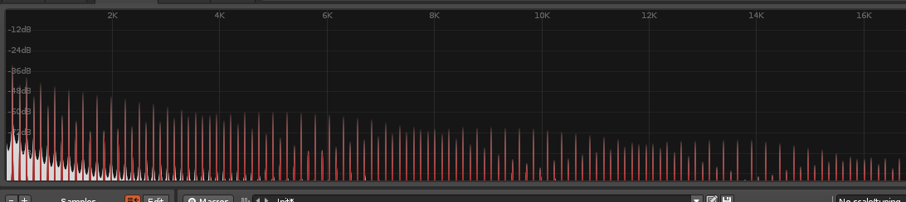
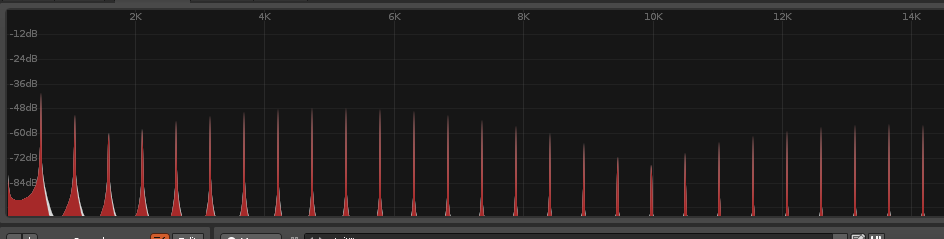

# Fourier Transform Symmetries

## Prerequisites

This page uses some definitions and notation from the following pages:

- [Uniform Circular Motion](./circular-motion.html)
- [Fourier Transform](./fourier-transform.html)

## Linearity

IMG: Make some example graphs to demonstrate linearity

> The Fourier transform is linear, which means:
> - Scaling the amplitude of a signal in time is the same as scaling the amplitude of the corresponding frequency spectrum
> - A superposition of signals in time is the same as a superposition of their corresponding frequency spectra

The Fourier Transform amounts to a fancy integral. And since it's an integral, it inherits linearity:

$$
\begin{align*}
    \mathscr{F}(af + bg) &= \int(af + bg) C_{-k} dt \\
    &= a\int f C_{-k} dt + b\int g C_{-k} dt \\
    &= a\mathscr{F}f + b\mathscr{F}g
\end{align*}
$$

## Reversing Time

> Reversing a signal in time is the same as reversing the corresponding spectrum

IMG: four graphs: a sine curve, its fourier transform (two peaks at n and -n), a backwards sine curve, and its fourier transform backwards. Use arrows between them to show that the operations commute

$$
\mathscr{F} f(-t) = \hat{f}(-k)
$$

- If you reverse a video of a signal rotating clockwise, it will now look like it is rotating counter clockwise and vice-versa
- Reversing a signal in time reverses the 
- Another way to say the same thing: The amplitudes for each pair of frequencies $-k, k$ swap
- In terms of the graphs, reflecting the 

IMG: Diagram of the time signal being flipped 

### Even Functions Have Even Spectra

> An even function in time has a Fourier spectrum that is also an even function

An even function is a function that has reflection symmetry over
the y-axis, i.e. $f(-t) = f(t)$.

Applying the time reversal symmetry:

$$
\begin{align*}
\mathscr{F}f(-t) &= \mathscr{F}f(t) \\
\hat{f}(-k) &= \hat{f}(k)
\end{align*}
$$

In other words, both the original signal and the frequency spectrum are even functions!

## Faster in Time, Spread Out in Frequency

> Scaling the frequency of a signal in time results in spreading out the frequency spectrum such that area is preserved.

$$
\mathscr{F}f(at) = \frac{1}{a}\hat{f}\left(\frac{k}{a}\right), a > 0
$$

Gory math details

$$
\begin{align*}
\mathscr{F}f(at) &= \int_{-\infty}^{\infty}f(at) C_{-k}(t)dt \\
\text{let} \; t' &= at \\
              t &= t'/a \\
              dt' &= a dt \\
\mathscr{F}f(at) &= \frac{1}{a}\int_{-\infty}^{\infty}f(t') C_{-k}(t'/a)dt' \\
     &= \frac{1}{a}\int_{-\infty}^{\infty}f(t') C_{-k/a}(t')dt' \\
     &= \frac{1}{a}\hat{f}\left(\frac{k}{a}\right)🪦

\end{align*}
$$

Interpretation of the equation:

- $f(at)$ is the signal with the frequency scaled by $a$ (here assumed to be a positive real number). Graphing the function, this squeezes the graph horizontally by a factor of $a$.
- $\hat{f}(k/a)$ means the frequency spectrum is scaled the opposite way. If we squeeze the time signal by a factor of 2, then the frequency spectrum is _stretched_ by a factor of 2.
- The coefficient of $1/a$ shrinks the frequency spectrum vertically by the same scaling factor.
- Combining the two effects, we've stretched horizontally by $a$ and shrunk vertically by $a$. This means the area _does not change!_ since $a/a = 1$
- In other words, we've spread out the frequency spectrum away from the origin so that area is prserved.

### Example: Transposing Pitch

For audio signals, scaling the input of a time signal is interpreted as increasing the pitch.

Above: Two audio spectra for the same waveform played first at a C3, then C5. The second is 2 octaves, or 4 times the frequency of the first.

Notice:

- The graph is shown with a _linear_ scale on the bottom instead of the more typical logarithmic scale.
- The peaks in the second plot are four times more spread out
    - As a result, the first peak (the perceived pitch of the note) is now 4 times higher in Hz, or 2 [octaves](./frequency-log-scale.html) higher
- It's hard to get a precise amplitude reading from these plots, but if you compare the first peak of each graph, the second graph has a shorter peak

## Phase Shift

> Delaying a signal in time corresponds to rotating the Fourier coefficients proportional to frequency

$$\mathscr{F}f(t - d) = C_{-k}(d)\hat{f}(k)$$

Gory math details

$$
\begin{align*}
\mathscr{F}f(t - d) &= \int f(t - d) C_{-k}(t) dt \\
\text{let}\; t' &= t -d \\
    t &= t' + d \\
    dt' &= dt \\
\mathscr{F}f(t - d) &= \int f(t') C_{-k}(t' + d) dt' \\
    &= \int f(t') C_{-k}(t')C_{-k}(d) dt' \\
    &= C_{-k}(d)\int f(t') C_{-k}(t') dt' \\
    &= C_{-k}(d)\mathscr{F}f \\
    &= C_{-k}(d)\hat{f} 🪦
\end{align*}
$$

Interpretation:

- $f(t - d)$ means delay the original signal by a delay of $d$ seconds
- From the [Uniform Circular Motion](./circular-motion.html) page, $C_{-k}$ can be interpreted as a _rotation_, so $C_{-k}(d)$ is a rotation by angle $\theta = {-2 \pi k d}$
    - This rotation is clockwise in the complex plane since the angle is negative
    - The angle is proportional to the phase shift $d$.
    - The angle is also proportional to the frequency $k$, since faster spinning components move further in the same amount of time

## Fourier Transform Has Order 4

> Repeating the (forward) Fourier transform 4 times results in the original signal!

🚧 Outline for now

IMG: Diagram of the four functions with arrows in between

At least for real-valued signals:

$$
\begin{align*}
\mathscr{F}f(x) &= \hat{f}(x) \\
\mathscr{F}\hat{f}(x) &= f(-x) \\
\mathscr{F}f(-x) &= \hat{f}(-x) \\
\mathscr{F}\hat{f}(-x) &= f(x) \\
\end{align*}
$$

Which is back where we started. We can write this as:

$$\mathscr{F}\mathscr{F}\mathscr{F}\mathscr{F} = \mathscr{F}^4 = I$$

In group theory, this would be described as "The Fourier Transform has order 4", or in other words, repeating the operation four times brings you back to where you started.

TODO:

- Add the math details - the sign of the complex exponential changes as you iterate, and that is where this pattern comes from. Also the time reversal symmetry is relevant.
- ❓Does this hold for all functions of complex numbers? or only for real values?
- For even functions, the Fourier Transform has order 2 instead