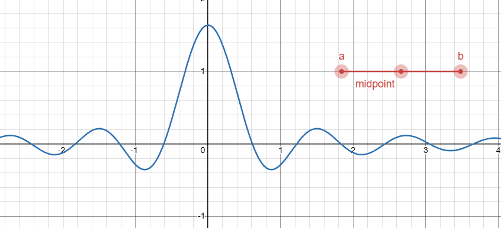

# Fourier Transform Pairs

## Building Blocks

This page uses definitions and notation from the following pages:

- [Uniform Ciruclar Motion](./circular-motion.html)
- [Fourier Transform](./fourier-transform.html)
- [Fourier Symmetries](./fourier-symmetries.html)

## Zero and Zero

> No signal in time = no frequency spectrum

$$\mathscr{F}0  = 0$$

Proof

The sum of a bunch of nothing is nothing.

$$\int 0 C_{-k} dt = \int 0 dt= 0$$

## Constant and Dirac Delta

> A constant function produces a single peak at frequency 0 (DC)

$$
\begin{align*}
 \mathscr{F} 1 &= \delta_0\\
 \mathscr{F} K &= K\delta_0 \\
\end{align*}
$$

Where $\delta_0$ is the [Dirac Delta](./dirac-delta.html). 

Interpretation:

- A constant function is represented as a single peak
- Frequency 0 means no oscillation

Gory math details

Let's compute the Fourier Transform

$$\mathscr{F}1 = \int_{-\infty}^\infty C_{-k} dt$$

Let's examine the integral. There are two cases here, $k = 0, k \ne 0$. Let's handle the first one:

$$\int_{-\infty}^\infty C_{0}(t) dt = \int_{-\infty}^\infty 1 dt$$

The function has a value of 1 everywhere, so the integral will blow up to infinity... For now, write down $\hat{f}(0) = \infty$.

Now let's tackle the other frequencies. 

$$\int_{-\infty}^\infty C_{-k} dt$$

We're adding up circular motion forever in both directions.
We can divide up this integral so we're always integrating a full cycle. At frequency $-k$, the period (duration of a full cycle) is $1/k$ seconds. So we chop up the integral as follows 🔪

$$\sum_{l=-\infty}^\infty\int_{l/k}^{(l + 1)/k} C_{-k}dt$$

But [the sum of a full cycle is 0](./circular-motion.html#adding-up-a-full-cycle), so this is the same as:

$$\sum_{l=-\infty}^\infty0 = 0$$

So in total we have:

$$\mathscr{F}1 = \begin{cases}
    \infty & k = 0 \\
    0 & k \ne 0
\end{cases} = \delta_0$$

Which proves the first statement.

The more general form, $\mathscr{F}K = K \delta_0$ is simply a result of applying the [linearity of the Fourier Transform](./fourier-symmetries.html#linearity).

$$\mathscr{F}K=\mathscr{F}K1 = K\mathscr{F}1 = K\delta_0$$

Why is it called a DC offset?

Often the 0 frequency is referred to as "DC" or "DC offset". This comes from electricity. In an electric circuit:

- direct current (DC) represents electric current that does not oscillate.
- alternating current (AC) represents electric current that oscillates (including reversing direction). This can happen at any frequency except 0.

In other words, AC happens at non-zero frequencies, but DC is the zero frequency.

The "offset" part refers to the fact that DC adds a constant amount to a time signal.

## Circular Motion and Shifted Dirac Delta

> Circular motion in time corresponds to a single spike at the corresponding frequency

$$\mathscr{F}C_n = \delta_n$$

Gory math details

## Rectangle and Sinc

> A short pulse centered on the origin in time corresponds to
> a frequency spectrum that ripples outwards from a peak at 0 frequency (DC)
>
> This serves as a building block for digital signals.

IMG: Diagram of both functions, it's hard to describe this in words.

$$
\mathscr{F}\text{rect}(t) = \text{sinc}(k)
$$

Where

$$
\text{rect}(t) = \begin{cases}
    1 & t \in [-1/2, 1/2] \\
    0 & \text{otherwise}
\end{cases}
$$

and 

$$
\text{sinc}(k) = \frac{\sin(\pi k)}{\pi k} \\
$$

TODO: Explain this one, this one takes a bit of calculus plus a trig identity

- Sketch of the gory details
    - it amounts to integrating circular motion for a _partial cycle_
    - For integer frequencies, it will be 1 at the origin, and 0 at all other integers (this is similar to [Dirac delta](./dirac-delta.html), except now the integration is finite)
    - For non-integer frequencies, you have to compute the integral. But since it's a pure circular motion, the integral is just an exponential funtion
    - With a little bit of rearranging, you can find the equation for a [sine wave](./sin-cos-circle.html) as circular motion hiding in the equation
    - It's not exactly a sine wave, but a sine wave that falls off as $1/k$ (inverse of the frequency)
    - Because we picked the domain to be from $[-1/2, 1/2]$, this happens to be exactly the definition of the normalized sinc function

## Boxcar and Transformed Sinc

> A boxcar function is a more general rectangular-shaped function.
> 
> The Fourier Transform of a boxcar is a scaled sinc function

[Interactive Desmos Graph](https://www.desmos.com/calculator/gtihvewonz)

Let's define a more general "boxcar" function that's like `rect`, but placed at a different interval $[a, b]$ instead of $[-1/2, 1/2]$

$$\text{box(t; a, b)} = \begin{cases}
    1 & t \in [a, b] \\
    0 & \text{otherwise}
\end{cases}$$

Its Fourier Transform can be described in a couple of equivalent ways:

- Integrating [uniform circular motion](./circular-motion.md) over the time interval $[a, b]$.
- Shifting and scaling the `sinc` function.

$$
\begin{align*}
 \mathscr{F}\text{box(t; a,b)} &= \int_a^b C_{-k} dt = \frac{1}{-2i\pi k}(C_{-k}(b) - C_{-k}(a))\\
 &= (b-a)C_{-k}\left(\frac{a + b}{2}\right)\text{sinc}((b-a)k)
\end{align*}
$$

Derivation of sinc formula by transforming the results for rect

First, notice that the boxcar function is just a scaled and shifted copy of `rect`

- It's scaled horizontally from a width of 1 to a width of $(b - a)$
- The center is shifted from 0 to $(a + b)/2$ (midpoint of the interval)
- The above corresponds to transforming the rectangle function as follows:

$$\text{box}(a, b) = \text{rect}\; \circ S^{-1}(b - a) \circ T^{-1}((a + b)/2) \\= \text{rect}\left(\frac{t - \frac{a + b}{2}}{b-a}\right)$$

Now we make use of [Fourier Transform symmetries](./fourier-symmetries.html)
to compute the Fourier Transform by modifying the pair for `rect`:

$$
\begin{align*}
 \mathscr{F}\text{rect}(t) &= \text{sinc}(k)\\
 \mathscr{F}\text{rect}\left(\frac{t}{b-a}\right) &= (b-a)\text{sinc}((b-a)k)\\
 \mathscr{F}\text{rect}\left(\frac{t - \frac{a + b}{2}}{b-a}\right) &= (b-a)C_{-k}\left(\frac{a + b}{2}\right)\text{sinc}((b-a)k)\\
 \mathscr{F}\text{box(t; a,b)} &= (b-a)C_{-k}\left(\frac{a + b}{2}\right)\text{sinc}((b-a)k)
\end{align*} 
$$

Proof that the sinc formula and direct integration are equivalent

Let's take that formula, expand it and simplify:

$$
\begin{align*}
\mathscr{F}\text{box(t; a,b)} &= (b-a)C_{-k}\left(\frac{a + b}{2}\right)\text{sinc}((b-a)k) \\
 &= \frac{(b-a)e^{-i \pi k(a + b)}\sin(\pi(b-a)k)}{\pi (b-a)k} \\
 &= \frac{e^{-i\pi k(a + b)}(e^{i \pi (b-a) k} - e^{-i\pi (b-a) k})}{2i\pi k} \\
 &= \frac{(e^{i \pi (b-a - a - b) k} - e^{i\pi (-b + a - a - b) k})}{2i\pi k} \\
 &= \frac{(e^{i \pi (-2a) k} - e^{i\pi (-2b) k})}{2i\pi k} \\
 &= \frac{(e^{-i 2 \pi b k} - e^{-i 2\pi a k})}{-2i\pi k} \\
 &= \frac{1}{-2i\pi k}(C_{-k}(b) - C_{-k}(a))\\
\end{align*}
$$

Direct integration gives the same thing:

$$
\begin{align*}
 \mathscr{F} \text{box}(t; a, b) &= \int_a^b C_{-k} dt \\
 &= \frac{1}{-2i\pi k}\bigl[C_{-k}\bigr]_a^b\\
 &= \frac{1}{-2i\pi k}(C_{-k}(b) - C_{-k}(a))\\
\end{align*}
$$

The sinc formula is messy to look at, but it describes the shape of the frequency
spectrum more explicitly

- The overall shape is still a sinc function!
- The sinc function is squished horizontally and stretched vertically by the same factor $(b-a)$
- The coefficients are rotated in the complex plane. This changes the phase, but not the magnitude.
