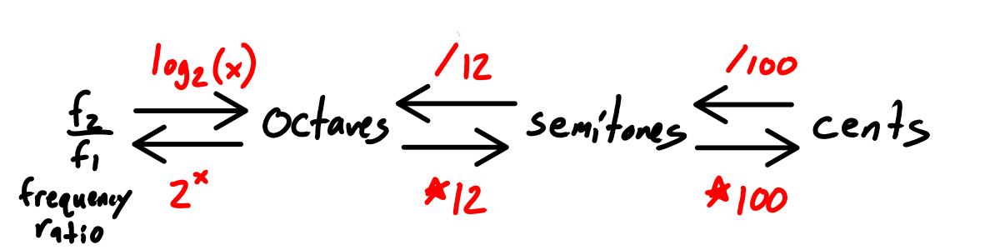
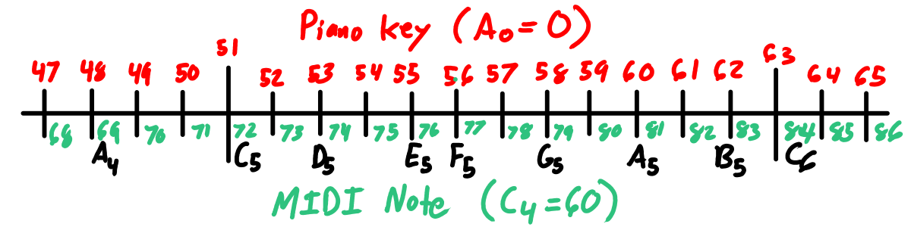

# Pattern: Logarithmic Frequency Scale



- A frequency ratio $f_2/f_1$ measures how fast frequency $f_2$ is compared to a reference frequency $f_1$.
- An octave is a frequency ratio of 2. 
    - We can generalize this to measure frequency ratios in terms of number of octaves (power of two difference). 
    - $2^O = f_2/f_1$
    - $O = \log_2(f_2/f_1)$ (inverse relationship)
- Dividing the octaves
    - In [12-tone equal temperament (wiki)](https://en.wikipedia.org/wiki/12_equal_temperament) (12-TET) tuning,  an octave is divided further.
    - 1 octave = 12 semitones
    - 1 semitone = 100 cents

Composing some of these relationships, we can define some
functions for calculating pitch differences either in octaves,
semitones, or cents.

```
oct(f2, f1) = log_2(f2/f1)
semi(f2, f1) = 12 * log_2(f2/f1)
cents(f2, f1) = 1200 * log_2(f2/f1)
```

## MIDI Notes and Piano Keys



Assuming standard tuning where $A_4 = 440$ Hz, and the first key on a piano is $A_0$ (see [piano key frequencies (wiki)](https://en.wikipedia.org/wiki/Piano_key_frequencies)), we have:

```
key(A0) = 0
key(A4) = 48 (4 octaves above A0)
key(f) = key(A4) + semi(f, A4)
       = 48 + 12 log_2(f / 440) semitones
```

The MIDI specification only requires that note 60 is middle C, the "middle C of an 88 note piano-style keyboard"[^1]. It does not, however, specify the octave number of Middle C. I prefer to use [scientific pitch notation (wiki)](https://en.wikipedia.org/wiki/Scientific_pitch_notation), which defines middle C as $C_4 $. Music software may use other conventions.


[^1]: MIDI 1.0 Detailed Specification, v4.2.1, page 10. MIDI Manufacturer's Association, 1996.

Combining the two, we have:

```
midi(C4) = 60
midi(A4) = 69
midi(f) = midi(A4) + semi(f, A4)
        = 69 + 12 log_2(f / 440) semitones
```

If you compare the two formulas, they're nearly identical. We
can describe the relationship as:

```
midi(f) - key(f) = 21 semitones
```

i.e. for a given pitch $f$, the MIDI note number will be 21 semitones higher than the key number.

## Related Patterns

- [Halfway up the Octave](./half-octave.html) - What interval is halfway up the octave? The answer depends on how you measure!
- [Logarithmic Scales](./log-scales.html) - Musical pitch forms a logarithmic scale with base 2. There are plenty of other log scales in other contexts, often with base 10.