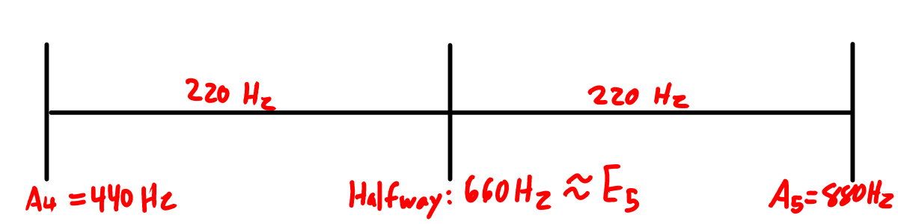
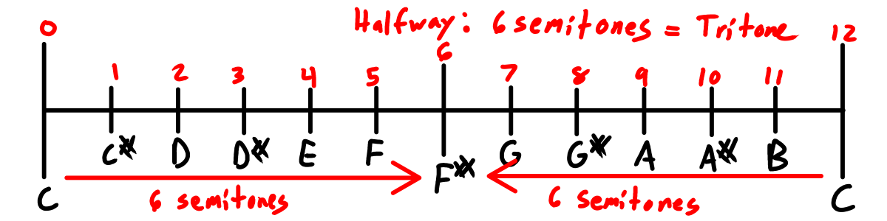

# Pattern: Halfway up the Octave

What musical interval is halfway up the octave? It depends on how you measure it! We can look at the halfway point in Hz
(which is linear) or in semitones (which are a [logarithmic scale](./frequency-log-scale.html)). Each gives a different answer.

## Halfway as a Ratio

> In terms of ratios, halfway is a 3:2 ratio, i.e. a (just) perfect fifth

Suppose we start at pitch $p$. One octave above this is pitch $2p$. So halfway between this would be a ratio that's the midpoint between 1 and 2. that is, 1.5, or a 3:2 ratio.

In the harmonic series, a 3:2 ratio is a perfect fifth! Specifically, the perfect fifth from [just intonation (wiki)](https://en.wikipedia.org/wiki/Just_intonation).

However, many instruments use [12-tone equal temperament (wiki)](https://en.wikipedia.org/wiki/12_equal_temperament) for tuning. The perfect fifth in 12-TET is flat by 2 cents.

"flat by 2 cents"

A perfect fifth in 12-TET is 7 semitones above the root.
Working backwards using the relationships from [frequency log scale](./frequency-log-scale.html), we have:

$$2^{7/12} \approx 1.498$$

This is slightly flat compared to the ideal 3:2 = 1.5 ratio.
How flat exactly? Let's compute it:

$$\text{cents}(2^{7/12}, 3/2) = 1200 \log_2(2^{7/12}/3/2) \approx -1.955$$

So the difference is about 2 cents flat, which is very tiny!

## Halfway in Semitones

> A tritone is halfway up the octave when measured in semitones

Since an octave is divided into 12 semitones, halfway would
be 6 semitones. In music, this interval is called a tritone.
This is approximately 1 semitone less than the frequency space answer of a just perfect fifth (~7 semitones).