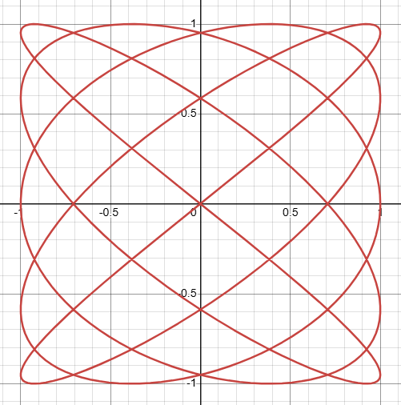
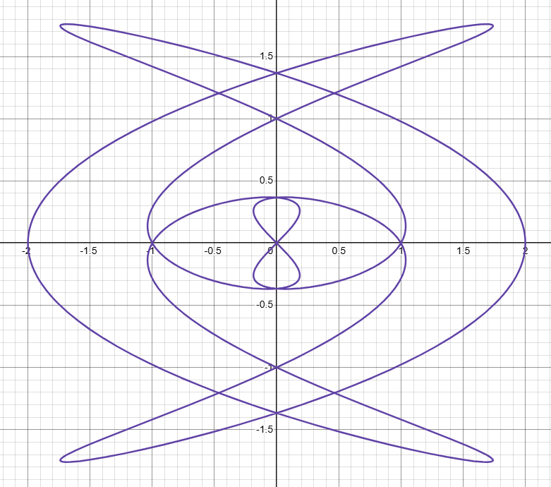

# Lissajous Patterns

🚧 Outline for now

- One representation for [Uniform Circular Motion](./circular-motion.html) is $C_n(t) = \cos_n + i\sin_n$ with a single frequency $n$
- What if we allow each sinusoid to have a different frequency? $a, b$
- Let's define $$L_{a, b} = \cos_a + i \sin_b$$
- TODO: explore properties of Lissajous curves

## As Sum of Circular Motions

- Can this be written as a sum of circular motions in the complex plane?
    - $L_{a,b} = \frac{1}{2}(C_a + C_{-a}) + i\left(\frac{1}{2i}\right)(C_b - C_{-b})$
    - $= \frac{1}{2}(C_a + C_{-a} + C_b - C_{-b})$
    - So the answer is yes!
    - [`symmetry-sketchbook` example link](https://ptrgags.dev/symmetry-sketchbook/#/curve_symmetry?custom_pattern=H4sIAAAAAAAACqtWKkstKs7Mz1OyMtRRKkktyi1WsopW0jXWMzAw0DEEk8Z6huYmSjpKuoZIggZ6BgYWSjpK2MSMMcRiawE5tXq7aQAAAA==)

## Generalizations

- Looking at the circular motion formula, it feels kinda arbirary. We have a sum of 4 circular motions in two pairs.
- Why stop there? we can always add more waves together

- [Desmos graph](https://www.desmos.com/calculator/zxabmczkq3) -- Adding two different Lissajous curves
    - Interestingly, some settings produce [rose curves](./rose-curves.html)!
- ❓What happens when you swap out the sine waves with other [basic waveforms](./basic-waves.html)
    - Will one choice of wave produce [mirror curves](./mirror-curves.html) which look similar?