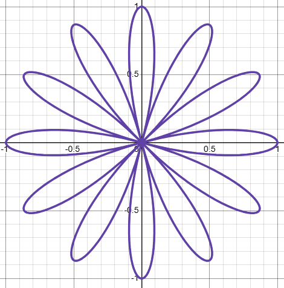

# Rose Curves

🚧 Outline for now

- Polar curve: $r(\theta) = \cos(n\theta)$
    - You can also use $\sin(n \theta)$, this produces the same curve but rotated.
- But polar curves $r(\theta)$ can be written $r(2\pi t)C_1(t)$ where $C_1(t)$ represents [uniform circular motion](./circular-motion.md) with frequency 1 Hz
- So we have $r(t) = \cos(2\pi n t)C_1(t)$, or $\cos_n C_1$ for short
- but $\cos_n = 1/2(C_n + C_{-n})$
- So we have $1/2(C_n + C_{-n})C_1 = 1/2(C_{1 + n} + C_{1-n})$
    - So we took the frequencies for $\cos_n$ and shifted them up by 1 Hz

## Generalizations

- What happens if you change $C_1$ to a higher frequency?
    - Not much. I tried this in Desmos, it seems to produce more rose curves
    - TODO: what's the pattern exactly?
- What happens if you add multiple rose curves?
    - [Directional rose curve](https://www.desmos.com/calculator/15lh9lblvj)
    - [Adding sine and cosine versions of curve](https://www.desmos.com/calculator/roulhxk5h7)

## Other Details

- Rose curves remind me of spherical harmonics... are they related? or just similar-looking