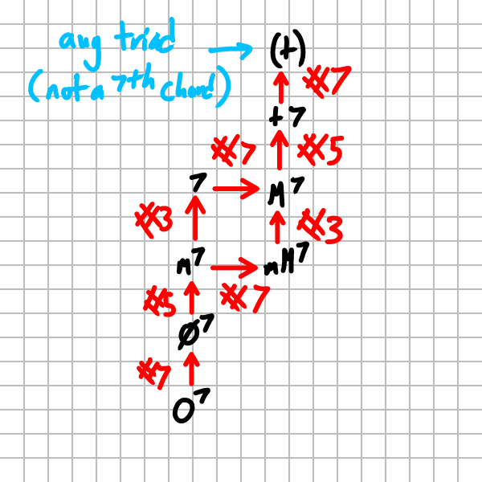
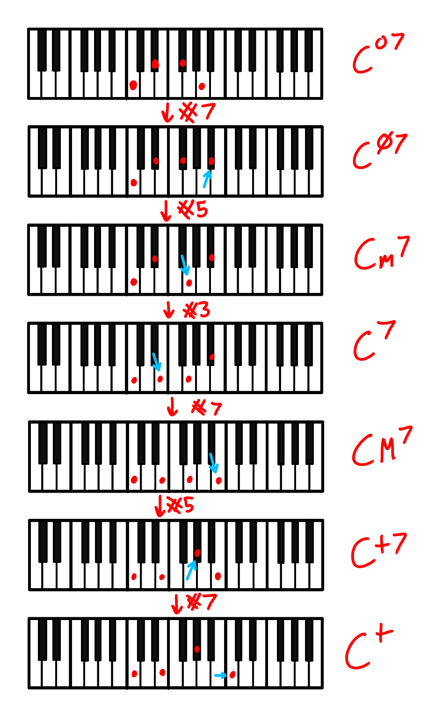
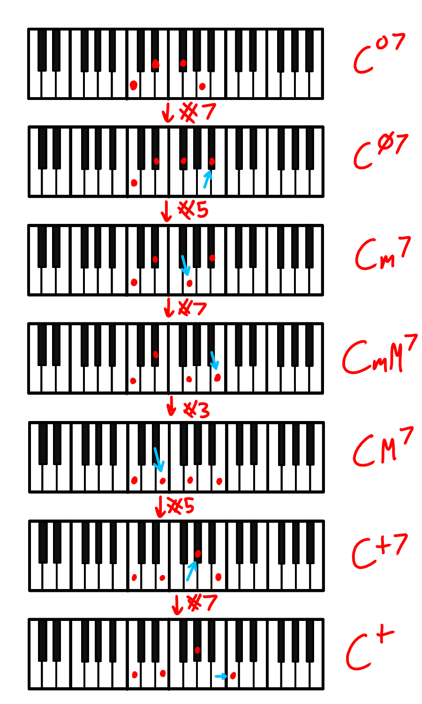

## Spooky Sevenths Progression

While exploring [seventh chords](./stacking-thirds.md#seventh-chords), I realized that you can order 6 out of 7 seventh chords into a progression that moves a single semitone at a time.



```
R  3  5   7    Chord Type
-------------------------
0  3  6   9       o7
0  3  6 (10)      ø7
0  3 (7) 10       m7
PATH A: -----------------
0 (4) 7  10        7
0  4  7 (11)      M7
PATH B: -----------------
0  3  7 (11)     mM7
0 (4) 7  11       M7
-------------------------
0  4 (8) 11       +7
0  4  8  12       + (triad, not seventh chord!)
```

## Example Progression

Starting on C<sup>o7</sup>, let's follow the diagram through both paths.



Taking the first path, we get 

C<sup>o7</sup>-C<sup>ø7</sup>-Cm7-C7-CM7-C+7-C+



Taking the other path, we get 

C<sup>o7</sup>-C<sup>ø7</sup>-Cm7-CmM7-CM7-C+7-C+

The main difference is the dominant seventh chord is replaced with a major minor seventh chord for the fourth chord in the progression.


## Why does it sound spooky?

I think this is because:

- Seventh chords often include dissonant intervals like tritones (6 semitones)
- The sevenths are not resolved in the usual way, keeping the tension going
- The only motion is a single half step at a time. Chromatic motion like this is often used in spooky tunes.

## Other Details

🚧 Outline for now

- ❓Is there an existing name for this progression? 
- ❓Can I find any examples of this?
- SOUND: Make some examples of this progression