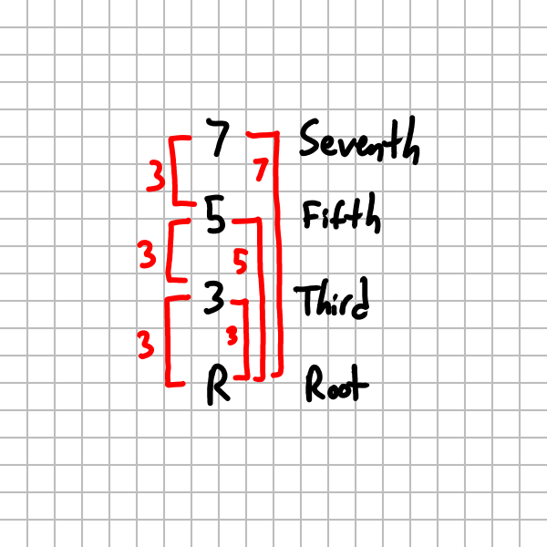
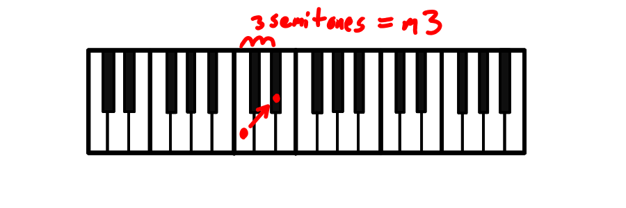
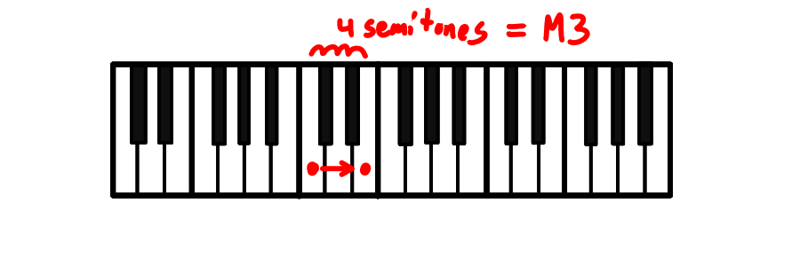

# Stacking Thirds Into Chords



In music, chords are built by stacking notes that are either a major or minor third apart. This page explores the various combinations.

## Thirds

There are two types of thirds in music, the major and minor third.

| Shorthand | Semitone Pattern | Third type  | Symbol | Semitones |
| --------- | ---------------- | ----------- | ------ | --------- |
| `m`       | `x..x`           | Minor third | m3     |  3        |
| `M`       | `x...x`          | Major third | M3     |  4        |

Examples:



C to Eb is a difference of 3 semitones, so this is a minor third.



C to E is a difference of 4 semitones, so this is a major third.


## Triads

Triads are a stack of two thirds. There are $2\times2 = 4$ ways to do this:

| Shorthand | Thirds Pattern | Semitone Pattern | Chord Type | Symbol              |
| --------- | -------------- | ---------------- | ---------- | ------------------- |
| d         | mm             | `x..x..x`        | Diminished | dim                 |
| m         | mM             | `x..x...x`       | Minor      | m                   |
| M         | Mm             | `x...x..x`       | Major      | M (usually omitted) |
| A         | MM             | `x...x...x`      | Augmented  | +                   |

Examples:

IMG: Diagram of these patterns

- C Eb Gb is a `Cdim` (C diminished) chord
- C Eb G is a `Cm` (C minor) chord
- C E G is a `C` (C major) chord
- C E G# is a `C+` (C augmented) chord

### Triad Semitone Patterns

Another way to look at triads is the pattern
of semitones above the root note

```
Semitones   Triad Type
0 3 6           d
0 3 7           m
0 4 7           M
0 4 8           A
```

## Seventh Chords

Seventh chords are a stack of three thirds. Or another way to think about it is take a triad and stack one more third on top.

> [!IMPORTANT] There are $2^3 = 8$ ways to stack three thirds... but only 7 of them produce a seventh chord!
> Stacking three major thirds makes the chord span a full octave. So the top note isn't a seventh, it's the root doubled at the octave!

| Thirds Pattern | Triad + Third | Semitone Pattern | Chord Type                         | Symbol |
| -------------- | ------------- | ---------------- | ---------------------------------- | ------ |
| mmm            | d + m         | `x..x..x..x`     | diminished seventh                 | <sup>o7</sup>     |
| mmM            | d + M         | `x..x..x...x`    | half-diminished seventh            | <sup>ø7</sup>     |
| mMm            | m + m         | `x..x...x..x`    | Minor seventh                      | m7     |
| mMM            | m + M         | `x..x...x...x`   | Minor major seventh                | mM7    |
| Mmm            | M + m         | `x...x..x..x`    | Dominant seventh                   | 7      |
| MmM            | M + M         | `x...x..x...x`   | Major seventh                      | M7     |
| MMm            | A + m         | `x...x...x..x`   | Augmented Seventh                  | +7     |
| MMM            | A + M         | `x...x...x...x`  | ⚠**Not a seventh chord!!!** augmented triad with doubled root | +      |

Examples:

- C Eb Gb Bbb is a C<sup>o7</sup> (C (fully) diminished 7th) chord
- C Eb Gb Bb is a C<sup>ø7</sup> (C half diminished 7th) chord
- C Eb G Bb is a Cm7 (C minor 7th) chord
- C E G B is a CM7 (C major 7th) chord
- C E G Bb is a C7 (C dominant 7th) chord
- C E G# B is a C+7 (C augmented 7th) chord

### Alternate Symbols

Confusingly, there are several different notations for each chord types.

- Fully Diminished 7th: <sup>o7</sup>, dim7
- Half Diminished 7th: <sup>ø</sup>, <sup>ø7</sup>, m7b5 ("minor 7th flat 5")
- Minor 7th: -7, m7, min7
- Minor Major 7th: mM7, m<sup>(M7)</sup>
- Dominant 7th: <sup>7</sup>, dom7
- Major 7th: M7, Maj7, Δ
- Augmented 7th: +7, aug7, 7#5 ("C seven sharp 5") 

## Seventh Chord Semitone Patterns

Again, we can also look at the pattern of
semitones for each chord type.

```
Semitones   Seventh Chord
0 3 6  9         o7
0 3 6 10         ø7
0 3 7 10         m7
0 3 7 11        mM7
0 4 7 10          7
0 4 7 11         M7
0 4 8 11         +7
0 4 8 12          + (triad, not seventh)
```

With some slight tweaks, this table can be turned into a [spooky chord progression](./spooky-sevenths-progression.html)

## Seventh Chord Relationships

There are several ways to compare chords to each other. This can help with remembering them

### Grouping by Triad Type

| Triad Type | + Minor Third | + Major Third |
|---|---|---|
| diminished | | <sup>ø7</sup> |
| minor | m7 | mM7 |
| major | 7 | M7 |
| augmented | +7 | + (**triad, not seventh!**)|

### Grouping by Largest Interval

For a seventh chord, the largest interval will be between the root and the seventh. We can group the seventh chords by this:

| Largest Interval | Semitones | Chord Types |
|---|---|---|
| bb7 | 9 | <sup>o7</sup> |
| b7 | 10 | 7, m7, <sup>ø7</sup>|
| 7  | 11 | M7, mM7, +7|
| #7 | 12 | + (**triad, not seventh!**) |

### Swapping Major and Minor Thirds

If you swap `m <--> M`, the seventh chords pair up in the following way:

| Chord | Swapped Chord |
| ---|---|
| `mmm` (<sup>o7</sup>) | `MMM` (+) (**triad, not seventh!**)|
| `mmM` (<sup>ø7</sup>) | `MMm` (+7) 
| `mMm` (m7) | `MmM` (M7)|
| `mMM` (mM7) | `Mmm` (7) |

## More Details

🚧 Outline for now

- ❓What are the patterns for 9th, 11th and 13th chords?
    - I'm guessing that impossible combinations due to doubled scale degrees will become more common
- SOUND: sound clips of these chords (both as harmony and arpeggiated) would be helpful
- Related patterns
    - Connections between this and [diatonic modes](./diatonic-modes.html) and chords (both triads and sevenths)