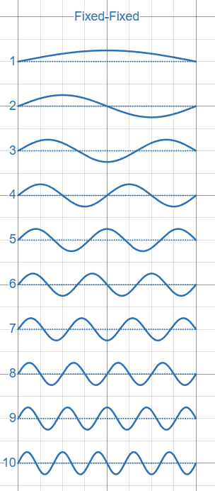
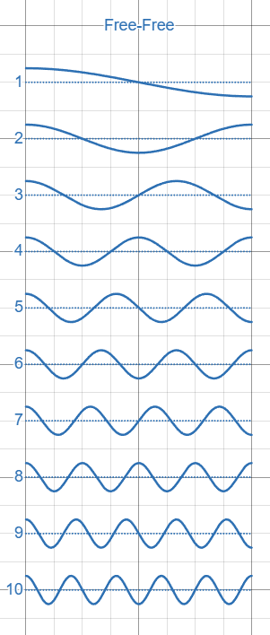
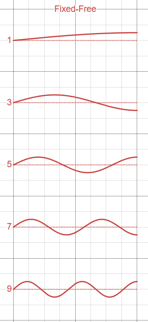

# String Harmonics

🚧 Outline for now

## Infinite String

- Obeys the wave equation
- Solutions can be _any_ sinusoid of any frequency or phase

## String Fixed at Both Ends

[Link to animated graph](https://www.desmos.com/calculator/upw7ahhwb4)

- String of length L
- Wave equation with constraints:
    - $f(0) = 0$
    - $f(L) = 0$
- Simplest solution: Half of a sine wave
    - Wavelength: $\lambda_1 = 2L$ m/cycle
    - $\sin(2\pi x / \lambda_1) = \sin(\pi x / L)$
    - Frequency: $f = v/\lambda_1 = v/(2L)$ 
    - $v$ is the speed of the wave in the string which depends on the string's density and tension
- Next solution: two halves of a sine wave
    - Now the wavelength is $\lambda_2 = L = \lambda_1/2$
    - The frequency is $f = v/\lambda_2 = 2v/(2L)$
- Pattern continues: $n$ half waves
    - Wavelength: $\lambda_n = \lambda_1/n$
    - Frequency: $f = nv/(2L)$
    - Wave: $f(x) = \sin(2 \pi n x / \lambda_1)$

## String Free at Both Ends

[Link to animated graph](https://www.desmos.com/calculator/upw7ahhwb4)

- Wave equation with constraints:
    - max amplitude at 0
    - max amplitude at L
- Same thing as the fixed-at-both-ends case, with a 1/4 cycle phase shift. In other words, replace $\sin$ with $\cos$.

## String Fixed at One End

[Link to animated graph](https://www.desmos.com/calculator/upw7ahhwb4)

- Again, string is length $L$
- But now the far end is free to move up and down
- Wave equation with constraints:
    - $f(0) = 0$
    - $f(L) = 1$ (max amplitude)
- Simplest solution: first quarter cycle of sine wave
    - Wavelength $\lambda_1 = 4L$
    - Frequency $f = v / \lambda_1 = v/(4L)$
    - $\sin(2 \pi x / (4 L))$
- Two quarter cycles don't work! that would make $f(L) = 0$, not 1
- Three quarter cycles work!
    - Wavelength $\lambda_3 = \lambda_1/3 = (4/3)L$
    - Frequency $f = v/\lambda_3 = 3v/(4L)$
- Four quarter cycles don't work, again, $f(L) = 0$
- Five quarter cycles work!
- Pattern continues: odd harmonics only
    - wavelength $\lambda_n = \lambda_1 / n = (4/n)L$ where $n = 1, 3, 5, ...$
    - Frequency $f = nv/(4L)$
    - Wave $f(x) = \sin(2 \pi n x / (4L))$

## Other Notes

- The above focuses on the spatial part of the wave only. The full wave equation also involves time. The waves will be multiplied by a sinusoid in time: $\sin(\omega t)\sin(2\pi n x / \lambda_1)$, with $v = \omega/k$ (rad/sec)/(rad/m) = m/s, i.e. a standing wave.
    - Note that using the product to sum formula,  $(1/2)(\sin(kx - \omega t) + \sin(kx + \omega t))$, this is what some texts mean when describing a standing wave as sum of two waves propagating in opposite directions.